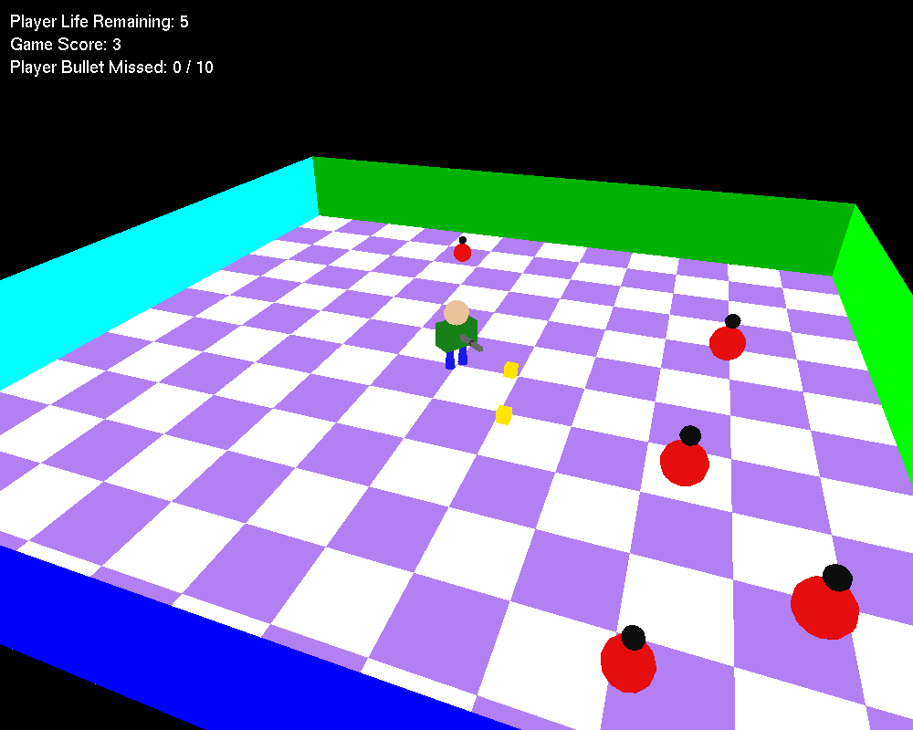
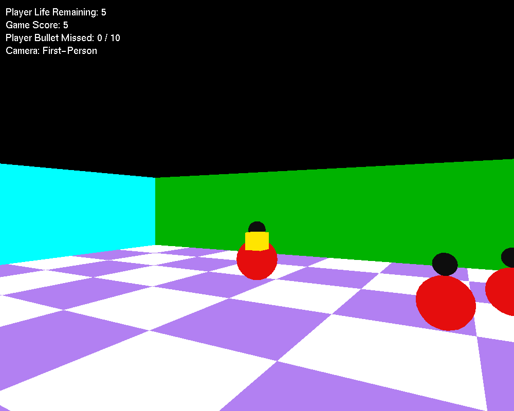

# Bullet Frenzy 3D

A 3D arena shooter written in Python with **PyOpenGL** and **GLUT**.

You stand in a walled arena while pulsing enemies close in from every side. Turn, aim and shoot them down. Don't let them reach you, and don't waste too many bullets.

| Third-person view | First-person view |
| --- | --- |
|  |  |

## Features

- **Built from OpenGL primitives:** a checkerboard floor, colored boundary walls, a player made of cylinders, cubes and spheres, and two-part enemies that pulse in size.
- **Two cameras:** a third-person camera you can orbit and raise or lower, and a first-person view from behind the gun.
- **Same speed on every machine:** movement, bullets and animation all use elapsed time, so the game doesn't depend on frame rate.
- **Collisions that don't skip:** each bullet is checked along its whole path every frame, so a fast shot can't pass through an enemy between frames.
- **Cheat mode:** the gun spins by itself and fires only when a shot will hit. An optional "cheat vision" points the first-person camera at the nearest enemy.
- **HUD:** shows lives, score and missed shots. There's a game-over screen, and you can restart instantly.

## Controls

| Input | Action |
| --- | --- |
| `W` / `S` | Move forward / backward in the gun's direction |
| `A` / `D` | Rotate left / right |
| Left click | Fire |
| Right click | Switch between first-person and third-person camera |
| `←` / `→` | Orbit the camera around the player |
| `↑` / `↓` | Raise / lower the camera |
| `C` | Toggle cheat mode |
| `V` | Toggle cheat vision (works in first person while cheat mode is on) |
| `R` | Restart |

## Rules

- You start with **5 lives**. You lose one each time an enemy reaches you.
- Each enemy you shoot scores **1 point**, and a new enemy appears somewhere else in the arena.
- A bullet that leaves the arena counts as a **miss**.
- The game ends when you run out of lives or reach **10 misses**. Press `R` to play again.

## Getting started

### Requirements

- Python 3.8 or newer
- [PyOpenGL](https://pypi.org/project/PyOpenGL/)
- FreeGLUT, the library PyOpenGL uses to open the game window (included with PyOpenGL on Windows; see the platform notes below)

### Install and run

```bash
git clone https://github.com/tanjilaafsarirubina/bullet-frenzy-3d.git
cd bullet-frenzy-3d
pip install -r requirements.txt
python bullet_frenzy.py
```

### Platform notes

**Windows:** PyOpenGL 3.1.10 and newer include FreeGLUT, so `pip install -r requirements.txt` is all you need. With an older PyOpenGL, the game stops at startup with:

```
OpenGL.error.NullFunctionError: Attempt to call an undefined function glutInit
```

To fix it, upgrade PyOpenGL:

```bash
pip install -U PyOpenGL
```

**Linux (Debian/Ubuntu):**

```bash
sudo apt install freeglut3-dev
```

On other distributions, install the `freeglut` package.

**macOS:** PyOpenGL uses the GLUT framework that comes with macOS. If it fails to load, upgrade PyOpenGL first with `pip install -U PyOpenGL`.

## How it works

The whole game is in [`bullet_frenzy.py`](bullet_frenzy.py). It is split into these sections:

| Section | What it does |
| --- | --- |
| Settings | All tunable numbers: arena size, speeds, lives, miss limit, camera limits and so on |
| Game logic | Spawning enemies, firing, bullet collisions, damage to the player, cheat-mode aiming |
| Drawing | Floor, walls, the player model, enemies and bullets |
| HUD | Text overlay on a translucent panel so it stays readable over the bright floor |
| Camera | Third-person orbit camera and first-person camera |
| GLUT callbacks | Keyboard, mouse, window resize, the idle game loop, and rendering |

A few details:

- **Game loop:** GLUT's idle callback measures the real time since the last frame. That step is capped at 50 ms, and the loop runs at no more than 120 FPS so it doesn't use a full CPU core.
- **Pulsing enemies:** each enemy has a phase value that its size follows along a sine wave. Its hitbox grows and shrinks with it.
- **Cheat aim:** the game measures how far each enemy is from the gun's line of fire and shoots only when that distance is inside the enemy's smallest possible hitbox. That's why cheat mode never misses.

Want a different feel? Change the constants at the top of the file, such as `ENEMY_SPEED`, `ENEMY_COUNT`, `BULLET_SPEED`, `START_LIVES` or `MAX_MISSES`.

## License

Released under the [MIT License](LICENSE).
